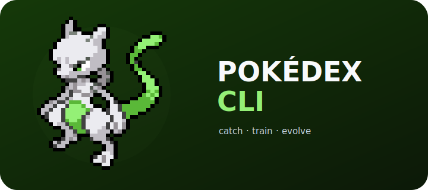

<p align="center">
  
</p>

<p align="center">
  
  
  
  
  
  
</p>

Una Pokédex local que convierte abrir la terminal y programar en una pequeña
aventura. Cada terminal puede traer un Pokémon de
[Krabby](https://github.com/yannjor/krabby): tú decides si verlo, capturarlo,
entrenarlo y formar un equipo.

El estado vive en SQLite, los datos de especies se enriquecen con
[PokeAPI](https://pokeapi.co) y la experiencia visual se renderiza con Rich. El
hook está diseñado para degradar con elegancia: un fallo externo nunca debe
costarte el prompt.

## Lo esencial

- Encuentros, captura probabilística, cuatro Pokéballs y formas alternativas.
- Equipo, experiencia por actividad Git y evoluciones por nivel.
- Funcionamiento offline mediante caché local y fallbacks acotados.
- Persistencia transaccional preparada para terminales concurrentes.
- Animaciones y sprites de terminal sin convertir el juego en un servicio.

## Inicio rápido

Requiere Python 3.11–3.13, Zsh, `rich`, `requests` y Krabby para los sprites.

```bash
./install.sh
pokedex --help
```

El instalador crea una copia estable en el directorio XDG, un shim en
`~/bin/pokedex` y el completado de Zsh. La activación del encuentro al abrir una
terminal está explicada en la [guía de instalación](docs/installation.md).

## Comandos habituales

| Comando | Acción |
|---|---|
| `pokedex ver` | Ver el encuentro actual |
| `pokedex capturar [-b bola]` | Intentar una captura |
| `pokedex bolsas` | Consultar stock y actividad |
| `pokedex list` | Ver la colección |
| `pokedex search <nombre>` | Consultar una especie o forma |
| `pokedex vision <id>` | Abrir la ficha de una captura |
| `pokedex equipo` | Gestionar el equipo |
| `pokedex demo` | Probar animaciones sin guardar estado |

## Documentación

La [documentación del proyecto](docs/README.md) está organizada por propósito:

- empezar y operar: [instalación](docs/installation.md) y
  [backup/recuperación](docs/operations.md);
- desarrollar: [testing](docs/testing.md), [gates](docs/change-gates.md) y
  [estándares](docs/engineering-standards.md);
- entender: [arquitectura](docs/architecture.md),
  [modelo de datos](docs/data-model.md) e [infraestructura](docs/infrastructure.md).

El sprite de cabecera se genera a partir del arte terminal de
[Krabby](https://github.com/yannjor/krabby) y se puede
[cambiar por cualquier nombre o forma](docs/logo.md).
