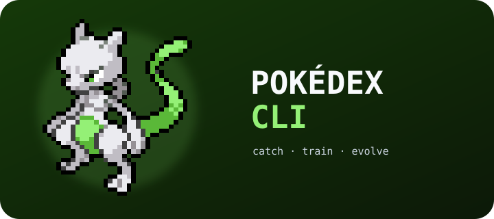
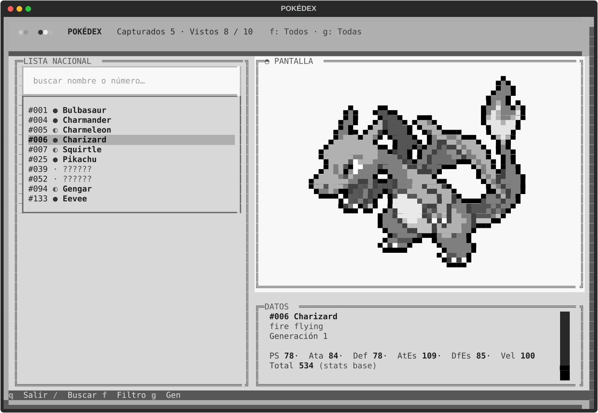

<p align="center">
  
</p>

<p align="center">
  
  
  
  
  
  
</p>

Pokédex en tu terminal. Cada terminal puede traer un Pokémon de
[Krabby](https://github.com/yannjor/krabby): tú decides si verlo, capturarlo,
entrenarlo y formar un equipo.

El estado vive en SQLite, los datos de especies se enriquecen con
[PokeAPI](https://pokeapi.co) y la experiencia visual se renderiza con Rich. 

## Inicio rápido

Requiere Python 3.11–3.13, Bash o Zsh, `rich`, `requests` y Krabby para los
sprites.

```bash
./install.sh
pokedex --help
```

El instalador crea una copia estable en el directorio XDG, un shim en
`~/bin/pokedex` y el completado de Bash y de Zsh. La activación del encuentro al
abrir una terminal está explicada en la
[guía de instalación](docs/installation.md).

## Inicio más rápido

Apaga el cerebro y dirige tu agente de código hacia [INSTALL.md](INSTALL.md).

## Comandos habituales

| Comando | Acción |
|---|---|
| `pokedex ver` | Ver el encuentro actual |
| `pokedex capturar [-b bola]` | Intentar una captura |
| `pokedex roca` | Aturdirlo: más captura, menos paciencia |
| `pokedex cebo` | Entretenerlo: más turnos, menos captura |
| `pokedex bolsas` | Consultar stock y actividad |
| `pokedex list` | Ver la colección |
| `pokedex list --legendarios` | Filtrar capturas legendarias y singulares |
| `pokedex search <nombre>` | Consultar una especie o forma |
| `pokedex vision <id>` | Abrir la ficha de una captura |
| `pokedex equipo [add\|remove] [id\|nombre]` | Gestionar el equipo o elegir en un selector |
| `pokedex refresh` | Borrar y recargar desde PokeAPI los datos de las capturas |
| `pokedex demo` | Probar animaciones sin guardar estado |

## Zona Safari

Un encuentro no se resuelve solo a Pokeballs. Como en Rojo Fuego y Esmeralda,
puedes trabajarte al Pokémon salvaje antes de lanzar:

| Acción | Captura | Paciencia | Estado |
|---|---|---|---|
| `pokedex roca` | ×2 (hasta ×8) | −1 turno | se enfada: más fácil de acertar, huye antes |
| `pokedex cebo` | ÷2 (hasta ÷8) | +2 turnos (máx. 9) | se acerca a comer: se queda, cuesta acertarle |

Rocas y cebos son ilimitados: lo que gastas es un turno del encuentro, el mismo
recurso que consume una Pokeball fallida. Cada acción tiene su animación, y el
estado se cuenta con palabras, como en el juego: `pokedex ver` dice si está
enfadado o comiendo, sin cifras. Añade `--debug` si quieres los números. La
Masterball ignora el ánimo, porque nunca falla.

```console
$ pokedex roca
¡La roca ha dado en el blanco! Charizard está enfadado.

$ pokedex ver
Charizard — sin capturar · está enfadado
```

Para verlas sin gastar un encuentro: `pokedex demo -a roca` y `pokedex demo -a cebo`
(añade `-r escape` para ver cómo se larga).

## Pokédex interactiva

Ejecuta `pokedex` sin argumentos para abrir la colección en una vista de lista.
Puedes buscar por nombre o número, filtrar por estado y generación, y consultar
los datos de cada Pokémon capturado. Pulsa `l` para mostrar solo legendarios y
singulares (también pendientes), y `Esc` para limpiar los filtros.

<p align="center">
  
</p>

## Documentación

La [documentación del proyecto](docs/README.md) está organizada por propósito:

- empezar y operar: [instalación](docs/installation.md) y
  [backup/recuperación](docs/operations.md);
- desarrollar: [testing](docs/testing.md), [gates](docs/change-gates.md) y
  [estándares](docs/engineering-standards.md);
- entender: [arquitectura](docs/architecture.md),
  [modelo de datos](docs/data-model.md) e [infraestructura](docs/infrastructure.md).
